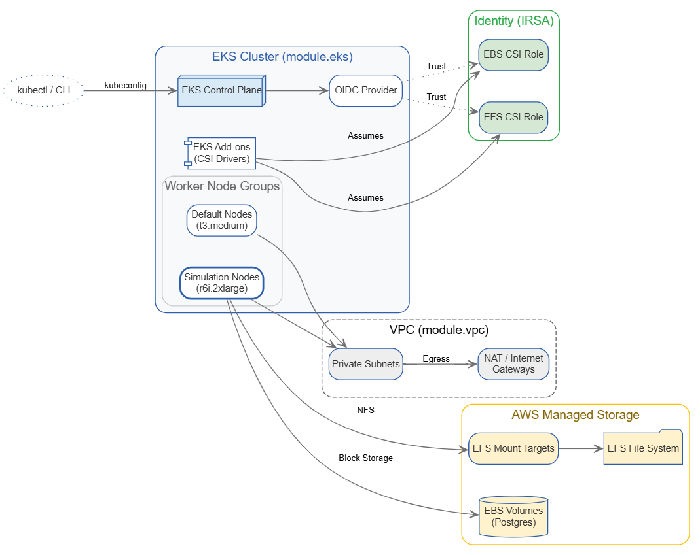

# A Reference Architecture for Optima on EKS: Automating Storage and Networking with Terraform

Running Optima simulations requires a delicate balance between high-performance compute and reliable data persistence. 
While AWS EKS offers the perfect playground, the 'glue' — IAM roles, CSI drivers for EFS/EBS, and cross-AZ 
networking — often becomes a bottleneck for teams aiming for customer-managed VPC deployment.

To align with the needs of our clients that are willing to host Optima on their AWS EKS cluster, we decided to share
the setup that we use internally to test on-premise deployment. To this end, an Infrastructure as Code (IaC) tool called
[`Terraform`](https://developer.hashicorp.com/terraform) will be used.


## Disclaimers

This article is not a full Optima on-prem deployment guide.

Applying the Terraform resources present in this repository will not result in the full Optima setup - none of our 
services will be running in the cluster. The goal is to establish an environment that has the infrastructural
prerequisites for deploying Optima.

The code we placed here can either be used 'as-is' or can be adjusted to the particular needs - always make sure to 
check the comments in the code for parts that might be particularly useful to customize to the reader's own needs.

As this is only a reference architecture, we do not provide implementation for remote backend functionality that is a
recommended practice when using `Terraform`.

## Prerequisites

To provision the EKS cluster as described in this article the following tools are needed:

- [`Terraform`](https://developer.hashicorp.com/terraform/install)
- [`AWS CLI`](https://docs.aws.amazon.com/cli/latest/userguide/getting-started-install.html)
- [`Kubectl`](https://kubernetes.io/docs/tasks/tools/#kubectl)


## Architecture

To provide a production-ready environment, we deploy the EKS cluster into a Multi-AZ VPC.
While our nodes reside in Private Subnets for security, we utilize Public Subnets to host the NAT Gateway, 
ensuring our private nodes can pull container images and security patches.




## Storage Strategy

One of the biggest hurdles in moving from on-prem to EKS is deciding where data lives. For Optima, we use a hybrid 
approach that mirrors a traditional data center's "Local vs. Network" storage:

Amazon EBS (The "Local" Disk): We use EBS for the Database layer. Because EBS provides high-performance, low-latency
block storage, it is the only choice for transactional data. It behaves like a physical SSD attached to your server, 
using the `ReadWriteOnce (RWO)` access mode.

Amazon EFS (The "Network" Share): We use EFS for Shared Static Artifacts (sensor data, trajectories, etc.). 
Like an on-prem NFS share, EFS allows multiple simulation pods to concurrently read and write to the same files 
across different Availability Zones using the `ReadWriteMany (RWX)` access mode.


## Security consideration

When deploying Optima in a customer-managed VPC, security is not just about perimeter defense; it’s about Identity, 
Isolation, and Encryption. Our reference architecture implements the following "Defense in Depth" layers:

1. **Network Isolation: The Private VPC**
In this setup, we prioritize a "Private-First" networking model.

Zero Direct Access: All EKS Worker Nodes and EFS Mount Targets are placed in Private Subnets. They do not have public
IP addresses and cannot be reached directly from the internet.

Controlled Egress: We use a NAT Gateway in the public subnets to allow nodes to pull container images or patches. 
While this simplifies the "demo" experience, it ensures that traffic is strictly outbound-only.

The Air-Gapped Path: For clients requiring even stricter isolation, the NAT Gateway can be replaced with 
AWS PrivateLink (VPC Endpoints) for services like ECR, S3, and STS. This allows the cluster to function
with zero path to the public internet.

2. **Identity: IRSA over Hard-coded Keys**
One of the most significant security upgrades in this architecture is the use of IAM Roles for Service Accounts (IRSA).

Temporary Credentials: Instead of baking AWS Access Keys into your application (which risk being leaked), 
we use the EKS OIDC provider to issue short-lived, automated credentials to the EBS and EFS CSI drivers.

Least Privilege: Each storage driver has a dedicated IAM role (via our ebs_csi_irsa and efs_csi_irsa modules) that 
grants only the specific permissions needed to mount volumes—nothing more.

3. **Traffic Control: Stateful Security Groups**
We use AWS Security Groups as a virtual firewall for our storage layer.

EFS Protection: The efs-sg security group acts as a gatekeeper for your simulation data. It is configured with an 
Ingress rule that only allows traffic on port 2049 (NFS) originating from within your VPC's CIDR block.

Stateful Flow: Because Security Groups are stateful, we don't need to open wide ranges for return traffic; 
the firewall automatically tracks simulation requests and allows the data to flow back to the authorized pods.

4. **Encryption: Data at Rest**
Security compliance often requires that data never touches a physical disk in plaintext.

EFS Encryption: In our aws_efs_file_system resource, encrypted = true is set by default. 
This ensures that sensor files and trajectories are encrypted using AWS-managed keys (or optionally, your own 
Customer Managed Keys).

EBS Persistence: Similarly, the EBS volumes provisioned by the CSI driver for your database are encrypted at rest, 
ensuring your transactional data remains protected even if the underlying hardware is decommissioned.


## Provisioning the infrastructure

Provisioning the cluster with `Terraform` is very straightforward. In the current directory, run the following:

```shell
terraform init && terraform apply
```

This will initialize the `Terraform` providers and modules and apply the infrastructure defined in the `.tf` files.
Once the processing finishes (provided that no error occur) run the following command to confirm the cluster is 
successfully established:

```shell
kubectl get nodes
```

You should see 6 nodes with `Ready` status.

The next step is to navigate to the `k8s/` catalog and run the same commands - the code present in this folder is 
responsible for provisioning storage classes and PVCs to the existing EKS cluster.

```shell
cd k8s
terraform init && terraform apply
```

After the command finishes confirm the success by running:
 
```shell
kubectl get pvc -n scensei
```

This should yield output similar to:

```terminaloutput
NAME                    STATUS   VOLUME                                     CAPACITY   ACCESS MODES   STORAGECLASS   VOLUMEATTRIBUTESCLASS   AGE
efs-scenarios           Bound    pvc-***                                    5Gi        RWX            efs-sc         <unset>                 4s
efs-logs                Bound    pvc-***                                    5Gi        RWX            efs-sc         <unset>                 5s
efs-trajectories        Bound    pvc-***                                    5Gi        RWX            efs-sc         <unset>                 5s
```


## Infrastructure deletion

If you want to remove the resources created in this guide, run the `terraform destroy` command first in the `eks/k8s` 
directory and then in `eks/`.
