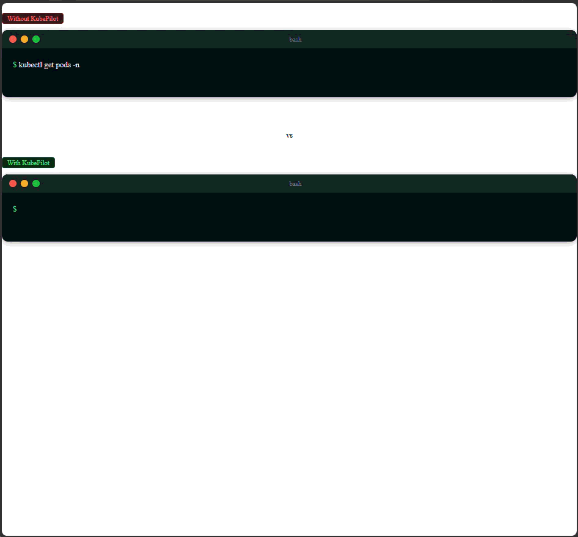

# KubePilot

An interactive CLI for Kubernetes. Select a pod from a live list and port-forward it, open a shell, or tail its logs — all without writing a single `kubectl` command.



## How does it compare to k9s?

[k9s](https://k9scli.io) is excellent — if you work with Kubernetes daily it is hard to beat. KubePilot is not trying to replace it. They solve different problems.

| | k9s | KubePilot |
|---|---|---|
| **Scope** | Full cluster management dashboard | Port-forward, shell, and logs only |
| **Workflow** | Keep the terminal window open, navigate the UI | Launch, do one thing, exit |
| **Learning curve** | Keyboard shortcuts, views, filters, plugins | Arrow keys to pick a pod, one flag per action |
| **Best for** | Deep cluster inspection and day-to-day ops | Quick access from a script, CI, or a fresh machine |

If you already have k9s open, use it. KubePilot is for the moments when you just need to forward a port or tail some logs without context-switching into a full dashboard — or when you are on a machine where installing k9s feels like overkill.

## Installation

### Linux

```bash
VERSION=0.3.0
wget -qO- https://github.com/Scensei-Optima/scensei-articles/releases/download/${VERSION}/kubepilot-linux-${VERSION}.tar.gz \
  | tar -xz
sudo mv kubepilot /usr/local/bin/
```

### macOS

```bash
VERSION=0.3.0
wget -qO- https://github.com/Scensei-Optima/scensei-articles/releases/download/${VERSION}/kubepilot-macos-${VERSION}.tar.gz \
  | tar -xz
sudo mv kubepilot /usr/local/bin/
```

### Windows

```powershell
$VERSION = "0.3.0"
Invoke-WebRequest `
  -Uri "https://github.com/Scensei-Optima/scensei-articles/releases/download/$VERSION/kubepilot-windows-$VERSION.zip" `
  -OutFile kubepilot.zip
Expand-Archive kubepilot.zip -DestinationPath .
```

Move `kubepilot.exe` to a directory on your `PATH`.

### Build from source

Requires Go 1.21+.

```bash
git clone https://github.com/Scensei-Optima/scensei-articles
cd kube-pilot
go build -o kubepilot .
```

## Requirements

- A valid kubeconfig at `~/.kube/config`
- Network access to the Kubernetes API server

## Usage

```
kubepilot [flags]
```

Run without flags to list pods in the `scensei` namespace and start port-forwarding the selected one.


```terminaloutput
$ ./kubepilot

...

Searching in namespace: scensei
Use the arrow keys to navigate: ↓ ↑ → ← 
? Select a Pod to Port-Forward to: 
  ▸ portal-664b4d8fbf-55q76
    reporter-6cf554bdd-x5lgb
    scheduler-d4969dfdd-kz7sj
    cesium-8fdb86c78-nw8r9
```

```terminaloutput
$ ./kubepilot -logs

...

Searching in namespace: scensei
✔ cesium-8fdb86c78-nw8r9
📋 Streaming logs from cesium-8fdb86c78-nw8r9...
[2026-06-19 11:53:38 +0000] [1] [INFO] Starting gunicorn 23.0.0
[2026-06-19 11:53:38 +0000] [1] [INFO] Listening at: http://0.0.0.0:8020 (1)
[2026-06-19 11:53:38 +0000] [1] [INFO] Using worker: gthread
[2026-06-19 11:53:38 +0000] [7] [INFO] Booting worker with pid: 7
[2026-06-19 11:53:38 +0000] [8] [INFO] Booting worker with pid: 8
[2026-06-19 11:53:38 +0000] [9] [INFO] Booting worker with pid: 9
[2026-06-19 11:53:38 +0000] [10] [INFO] Booting worker with pid: 10
```

### Flags

| Flag | Default | Description |
|---|---|---|
| `-n <namespace>` | `scensei` | Namespace to search |
| `-l <selector>` | | Label selector, e.g. `app=web` |
| `-local <port>` | `8080` | Local port to bind |
| `-remote <port>` | | Override the remote port (skips auto-detection from pod spec) |
| `-attach` | | Open an interactive shell in the selected pod |
| `-logs` | | Stream logs from the selected pod |
| `-tail <n>` | `100` | Number of recent lines shown before tailing live (only with `-logs`) |

`-attach` and `-logs` are mutually exclusive.

### Port forwarding

```bash
# Scensei namespace, port 8080
kubepilot

# Specific namespace and local port
kubepilot -n production -local 3000

# Filter by label
kubepilot -n production -l app=api
```

### Interactive shell

```bash
kubepilot -attach
```

Drops into `/bin/sh` inside the selected pod. Press `Ctrl+C` or type `exit` to detach.

### Log streaming

```bash
kubepilot -logs
kubepilot -l app=worker -logs
```

Shows the last 100 lines then tails live. Press `Ctrl+C` to stop.

## Development

```bash
git clone https://github.com/Scensei-Optima/scensei-articles
cd kubepilot/kube-pilot
go test ./...
```

### Pre-commit hooks

Install [pre-commit](https://pre-commit.com), then from the repo root:

```bash
pre-commit install
```

Runs `go fmt` and `go vet` on every commit.
